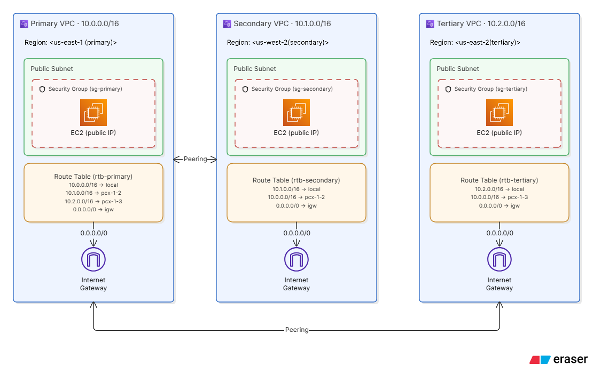

# Multi-Region VPC Peering (3 Regions) — Terraform

## Overview
This project provisions **three VPCs across three AWS regions** and establishes full-mesh peering from a primary hub, using Terraform provider aliasing for multi-region resource management. Each VPC hosts a public EC2 instance, and peering connections allow private cross-VPC communication.

## Architecture



Primary peers directly with both Secondary and Tertiary. Peering is **not transitive** — Secondary and Tertiary cannot reach each other without a direct peering connection between them (visible above: each route table only lists a route to the VPC it directly peers with).

## Components Provisioned

**Per region (×3):**
- VPC with DNS support/hostnames enabled
- Public subnet with auto-assigned public IPs
- Internet Gateway
- Route table (default route to IGW + peering routes)
- Security group (SSH, ICMP and TCP from peered CIDRs)
- EC2 instance (t2.micro, Amazon Linux 2)

**Cross-region:**
- VPC Peering: Primary ↔ Secondary
- VPC Peering: Primary ↔ Tertiary
- Peering accepters with auto-accept enabled
- Bidirectional routes for each peering connection

## Provider Configuration

Three aliased AWS provider blocks (`primary`, `secondary`, `tertiary`), each pointing to the same shared credentials profile but a different region:

```hcl
provider "aws" {
  region                    = var.primary
  shared_config_files       = ["~/.aws/config"]
  shared_credentials_files  = ["~/.aws/credentials"]
  profile                   = "Vscode-TERRAFORM"
  alias                     = "primary"
}
```

Every resource explicitly sets `provider = aws.<alias>` — there is no default (unaliased) provider block, so any resource missing this argument will fail at plan time.

## Prerequisites

- AWS account with credentials configured under a named profile
- Terraform >= 1.0
- SSH key pair created in each region (same name recommended)

```bash
aws ec2 create-key-pair --key-name vpc-peering-demo --region <primary-region> --query 'KeyMaterial' --output text > vpc-peering-demo-east.pem
aws ec2 create-key-pair --key-name vpc-peering-demo --region <secondary-region> --query 'KeyMaterial' --output text > vpc-peering-demo-west.pem
aws ec2 create-key-pair --key-name vpc-peering-demo --region <tertiary-region> --query 'KeyMaterial' --output text > vpc-peering-demo-east2.pem

chmod 400 *.pem
```

## Setup

```bash
cp terraform.tfvars.example terraform.tfvars
# edit terraform.tfvars with your region and key names

terraform init
terraform plan
terraform apply
```

## Testing Connectivity

```bash
terraform output

ssh -i vpc-peering-demo-east.pem ec2-user@<PRIMARY_PUBLIC_IP>
ping <SECONDARY_PRIVATE_IP>
ping <TERTIARY_PRIVATE_IP>
```

## Issues Hit and Fixed During Build

**1. `InvalidClientTokenId` on `terraform plan`**
Surface error pointed at AWS credentials, but the root cause was structural: four tertiary-region resources (`aws_vpc.tertiary_vpc`, `aws_subnet.tertiary_subnet_vpc`, `aws_internet_gateway.tertiary_igw`, `aws_route_table.tertiary_rt`) were missing `provider = aws.tertiary`. Without it, Terraform fell back to a default provider that doesn't exist in this config, which surfaced as a bad STS call. Fix: explicit `provider =` on every resource, no exceptions.

**2. Tertiary instance had no public IP**
`aws_subnet.tertiary_subnet_vpc` was missing `map_public_ip_on_launch = true` (present on primary/secondary subnets, omitted here). Fix: added the argument. Note this only applies to new launches — an existing instance needs to be tainted/recreated, or given a manual Elastic IP, to pick up the change.

## Known Limitations

- VPC peering is not transitive — Secondary ↔ Tertiary needs its own peering connection if required
- No NAT Gateway — instances rely on public IPs, not a private-subnet + NAT pattern
- Max 125 peering connections per VPC (AWS hard limit)

## Cleanup

```bash
terraform destroy
```

Removes all VPCs, subnets, EC2 instances, peering connections, route tables, and IGWs across all three regions.
